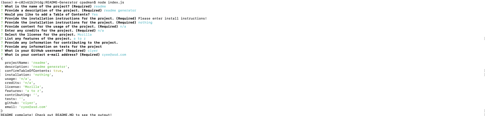
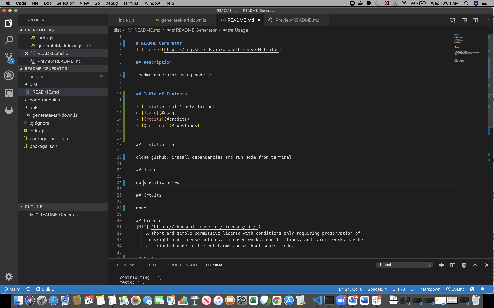
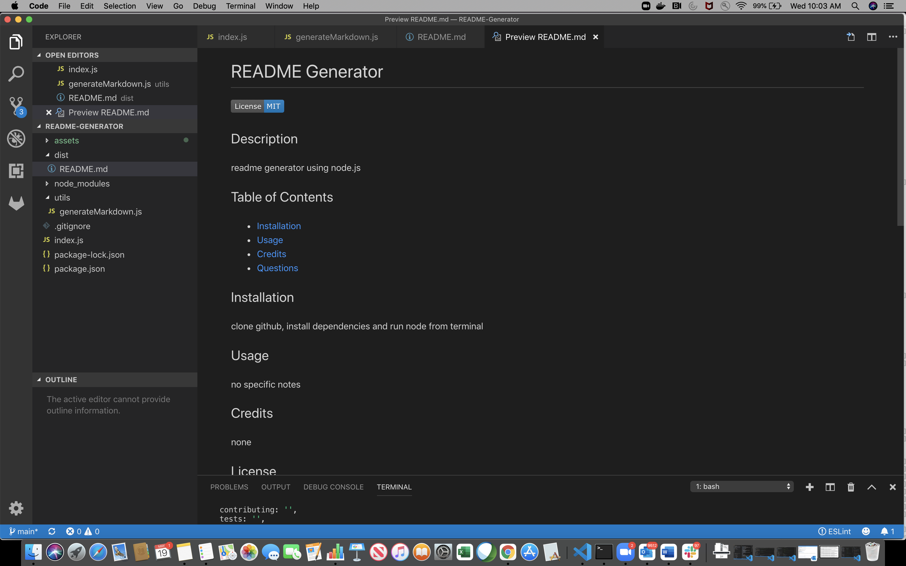

# README-Generator

## Description

This project uses node.js to log the answers to inquirer prompt questions and uses the answers to create a readme file for the user's project

## User Story

AS A developer
I WANT a README generator
SO THAT I can quickly create a professional README for a new project

## Table of Contents

  * [Installation](#installation)
  * [Usage](#usage)
  * [Credits](#credits)
  * [Questions](#questions)
  
## Installation

Clone the repo and run the command npm install to install dependencies

## Usage

* user questions

  
  
* readme generator output

  

* readme generator preview

  
  
* walkthrough video
 
  
  
* google drive link of the recording - https://drive.google.com/file/d/1Gj-vpbogCaZzHmD1_REV8XxEVYL7g6b9/view
    
## License

[MIT](https://choosealicense.com/licenses/mit/)
A short and simple permissive license with conditions only requiring preservation of 
copyright and license notices. Licensed works, modifications, and larger works may be 
distributed under different terms and without source code.

## Credits

Made by Chitra Padmanabhan

## Questions

[Contact me](chitra.iyer00@gmail.com)

[GitHub](https://github.com/ciyer87)

